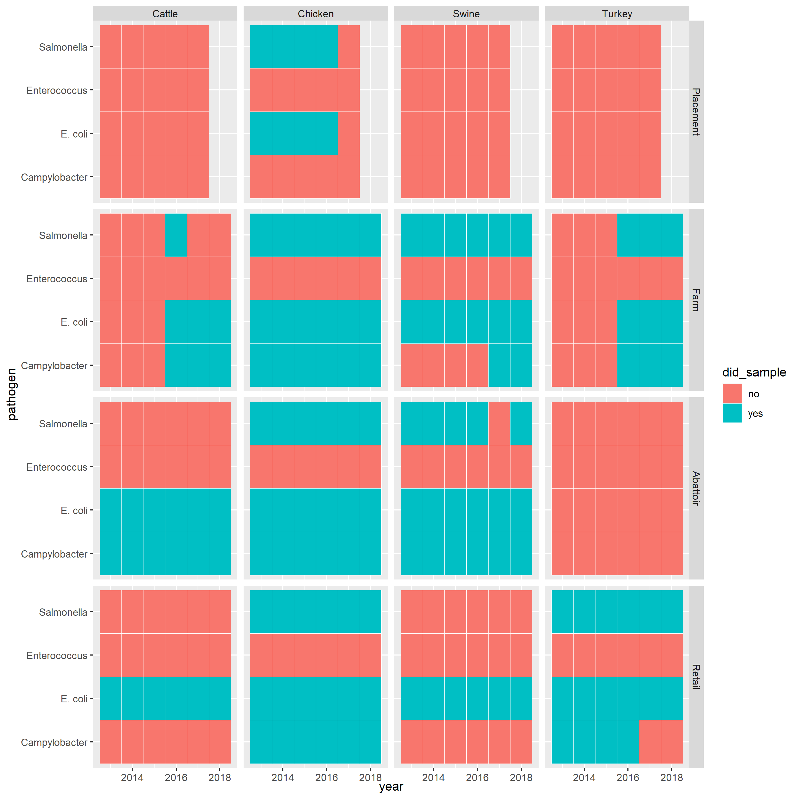

# CIPARS AMR Sampling Regime

This is an unofficial summary of the CIPARS AMR sampling regime. The squares in blue indicate where data are available. 

## Sampling Considerations

### 2016
---

#### Farm
- The CIPARS Farm Surveillance feedlot beef component was initiated in 2016. Sampling is currently only being done in the Alberta FoodNet Canada site, however, expansion into a nation program is the long term objective.
  - pg 267

#### Abattoir
- NA

#### Retail
- Recovery of Campylobacter from ground turkey was stopped mid-2016 due low prevalence and to free-up additional laboratory capacity.
  - pg 264 
- In pork, both Salmonella and E. coli were cultured, but only isolates of E. coli underwent antimicrobial susceptibility testing for routine surveillance and annual reporting.
  - pg 264 
- Additionally, during the 2016 sampling year in Ontario, only a partial year’s worth of retail sampling was conducted due to the availability of sampling technician staff. As a result, the sampling target and subsequent isolate yields in this province were not achieved and therefore, all retail data presented for Ontario in 2016 should be interpreted with caution.
  - pg 265 

### 2017
---

#### Farm
- Sampling is currently only being done in the Alberta FoodNet Canada site, however, expansion into a nation program is the long term objective.
  - pg 28

#### Abattoir
- NA

#### Retail
- Additionally, during the 2017 sampling year in Ontario, only a partial year of retail sampling was conducted due to the availability of sampling technician staff. As a result, the sampling target and subsequent isolate yields in this province were not achieved and therefore, all retail data presented for Ontario in 2017 should be interpreted with caution.
  - pg 24

### 2018
---

#### Farm
- Sampling is currently only being done in the Alberta FoodNet Canada site, however, expansion into a nation program is the long term objective.
  - pg 28

#### Abattoir
- NA

#### Retail
- In 2018, retail meat samples were collected routinely in British Columbia, and Québec. Only a partial year of sampling was conducted in the Prairies (a region including the provinces of Saskatchewan, Alberta, and Manitoba32) and Ontario and thus no temporal data are presented in 2018. Unlike previous years (2013 and 2014), no data were presented in recent years (2015 to 2018) for the Atlantic region (a region including the provinces of New Brunswick, Nova Scotia, Prince Edward Island, and Newfoundland and Labrador) as retail sampling activities in this region were suspended due to budgetary constraints.
  - pg 24

